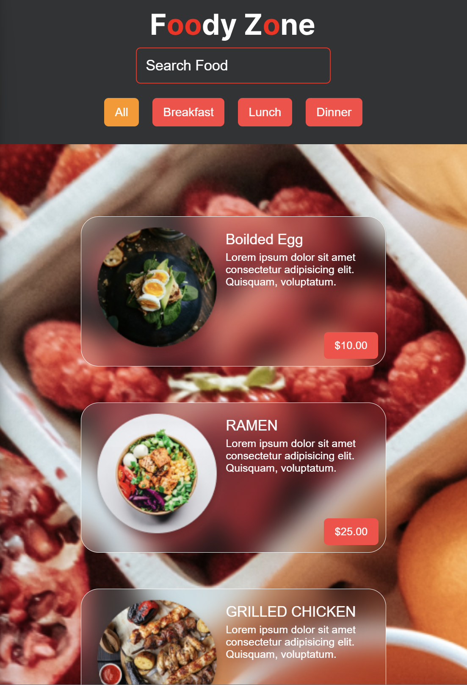
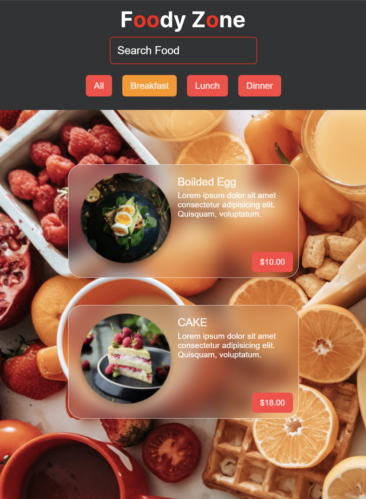

# Foody Zone
This project is a web application that allows users to search and filter through various food items, making it easier to find their desired dishes.

## Features

- **Search Functionality**: Users can search for specific food items using the search bar.
- **Filtering Options**: Users can filter food items based on categories such as Breakfast, Lunch, and Dinner.
- **Responsive Design**: The application is responsive, ensuring a seamless experience across different devices.
- **Styled with Styled Components**: The UI is styled using the styled-components library for a sleek and modern look.
- **Dynamic Content Loading**: Data is fetched dynamically from a backend server.

## Technologies Used

- **React**: Frontend development is done using React, providing a fast and interactive user interface.
- **Styled Components**: Styling is achieved with styled-components, allowing for dynamic styling based on component state.
- **Backend**: Data is fetched from a backend server running on Node.js and Express.
- **REST API**: The backend server provides data through a RESTful API, ensuring efficient communication between the frontend and backend.

